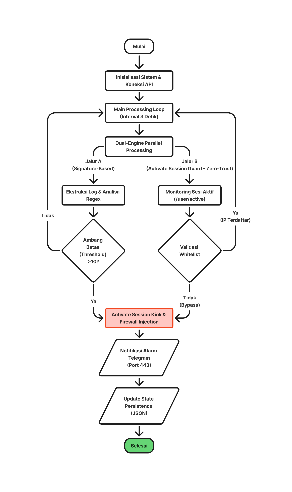

  <picture>
    <source media="(prefers-color-scheme: night)" srcset="../assets/logos/TME-logo01.png" />
    
  </picture>

<h1 align="center">
  <b align="center">TEUNGKU MITIGATION ENGINE - Core</b>
</h1>

**TME-CORE** (*Teungku Mitigation Engine - Core*) adalah sebuah mesin mitigasi keamanan otonom berbasis External Controller (Python) yang dirancang untuk melindungi fungsionalitas Control Plane router MikroTik dari ancaman serangan brute force SSH (Port 22) dan FTP (Port 21).

Proyek ini dibangun sebagai bagian dari penelitian tugas akhir/skripsi pada program studi [`Teknologi Rekayasa Komputer Jaringan`](https://trkj.pnl.ac.id/), [`Politeknik Negeri Lhokseumawe`](https://pnl.ac.id/).

## 💡 Kenapa Proyek Ini Penting & Berguna?
Pada perangkat jaringan tingkat tepi (*edge router*) dengan sumber daya terbatas (seperti MikroTik hAP lite / [<kbd>`RB941-2nD-TC`](https://mikrotik.com/product/RB941-2nD-TC)), memproses serangan *brute force* masif yang bertubi-tubi akan menyiksa CPU hingga mencapai **utilitas puncak 100%**. Skenario tanpa mitigasi ini berakibat fatal: 
1. Router menjadi **sangat lambat** (*severe lag*), tidak responsif, dan paket-paket data penting mengalami gangguan. 
2. Memaksa prosesor bekerja keras dalam jangka panjang memicu *hardware stress* dan **system crash** (kelumpuhan total). 
3. Melakukan analisis log di dalam router menggunakan *internal scripting* bawaan RouterOS justru memperburuk utilisasi CPU router itu sendiri.

### Solusi TME-CORE: *Offloading Processing*
TME-CORE memecahkan masalah ini dengan memindahkan beban kerja komputasi analitik (*offloading processing*) keluar dari router menuju server Linux (Debian) menggunakan protokol **API port 8728**. 
- **Jalur A (Signature Block):** Melakukan polling data log secara presisi, mengekstrak IP, mengeliminasi duplikasi deteksi (*anti-double-counting*), dan memerintahkan router memblokir penyerang via *Firewall Address-List*. 
- **Jalur B (Active Session Guard - Zero Trust):** Mengawasi anomali akses. Jika entitas di luar *whitelist* berhasil masuk (*login success*), sistem langsung memutus sesi aktif menggunakan mekanisme *3-Tier Fallback Session Kick* (API `request-logout` &rarr; API `remove` &rarr; Firewall Connection Teardown) dan mengisolasi IP-nya seketika.

## 🗺️ Arsitektur Aliran Data

## 🚀 Bagaimana Saya Memulainya?
Ikuti panduan langkah demi langkah di bawah ini untuk memasang dan menjalankan TME-CORE di lingkungan laboratorium atau jaringan produksi Anda.

## 📈 Struktur Data Evaluasi
Seluruh hasil pemantauan dan barang bukti eksperimen disimpan secara terpisah di dalam folder `/data` guna menunjang pengolahan statistik skripsi Anda: 
- `/data/db/tme_state.json`: Menyimpan memori persisten status ancaman, hitungan kegagalan presisi, dan IP terblokir (*State Persistence*). 
- `/data/metrics/evaluasi_kinerja.csv`: File relasional berisi metrik Beban CPU, Memori RAM Bebas, Latensi, dan Packet Loss saat mitigasi terjadi (mendukung pencatatan mitigasi *UNAUTHORIZED_SUCCESS*). 
- `/data/logs/tmecore_system.log`: Log internal historis aktivitas mesin mitigasi TME-CORE.

## 🤝 Berkontribusi (Contributing)
Kami sangat menyambut baik kontribusi untuk pengembangan sistem ke depan! Silakan baca [CONTRIBUTING](CONTRIBUTING.md) untuk detail panduan, penulisan kode (*SOP*), dan proses penyerahan *Pull Request*.

## 🏷️ Versi Rilis (Versioning)
Sistem ini dikelola menggunakan skema penomoran versi [SemVer](https://semver.org/). Untuk melihat histori versi, perubahan fitur, dan rilis versi stabil, silakan kunjungi halaman [Releases](/releases).

## 👨‍💻 Penulis (Authors)
**Teungku Zulkifli** - *Pemilik Proyek & Penulis Utama* - [TEUNGKU-ZULKIFLI](https://teungku-zulkifli.github.io/)

## 📄 Lisensi (License)
Proyek ini dilisensikan di bawah Lisensi MIT - Lihat berkas [LICENSE](LICENSE.md) untuk informasi lebih detail.

## 🎓 Penghargaan (Acknowledgments)
- Terima kasih yang sebesar-besarnya kepada **Dosen Pembimbing Utama (DPU)** & **Dosen Pembimbing Pendamping (DPP)** Jurusan Teknologi Informasi dan Komputer, Politeknik Negeri Lhokseumawe atas bimbingan akademisnya. 
- Rekan-rekan mahasiswa angkatan Teknologi Rekayasa Komputer Jaringan (TRKJ).
