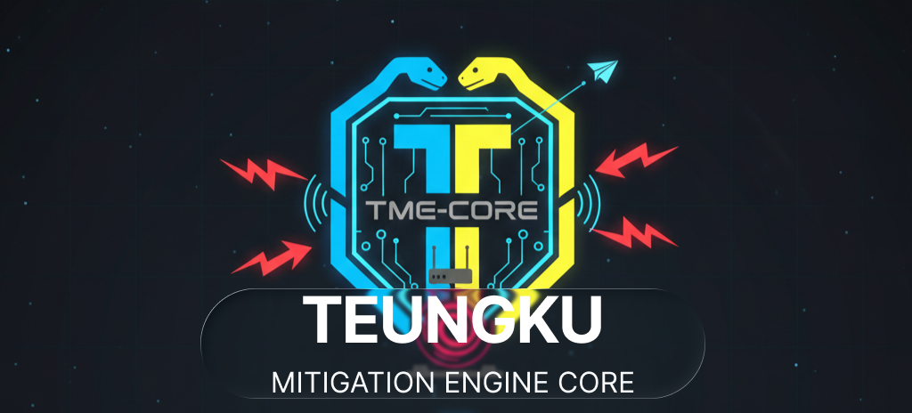

    <picture>
      <source media="(prefers-color-scheme: light)" srcset="./assets/logos/TME-banner.png" />
      
  </picture>

<h1 align="center">
  TME-CORE
   Teungku Mitigation Engine - Core 
</h1>
<h3 align="center">
  <a href="./docs/getting_started.md">🚀 Getting Starting</a>
   · 
  <a href="./docs/all-tahapan.md">📑 Documentation</a>
   · 
  <a href="#-apa-itu-tme-core">ℹ️ Apa itu TME-CORE</a>
   · 
  <a href="#-cara-kerja-tme-core">🛠️ Cara Kerja TME-CORE</a>
   · 
  <a href="#-fitur-utama">✨ Fitur Utama</a>
   · 
  <a href="#-tujuan">🎯 Tujuan</a>
</h3>

## ℹ️ Apa itu TME-CORE

## 🛠️ Cara Kerja TME-CORE

## ✨ Fitur Utama

## 🎯 Tujuan
