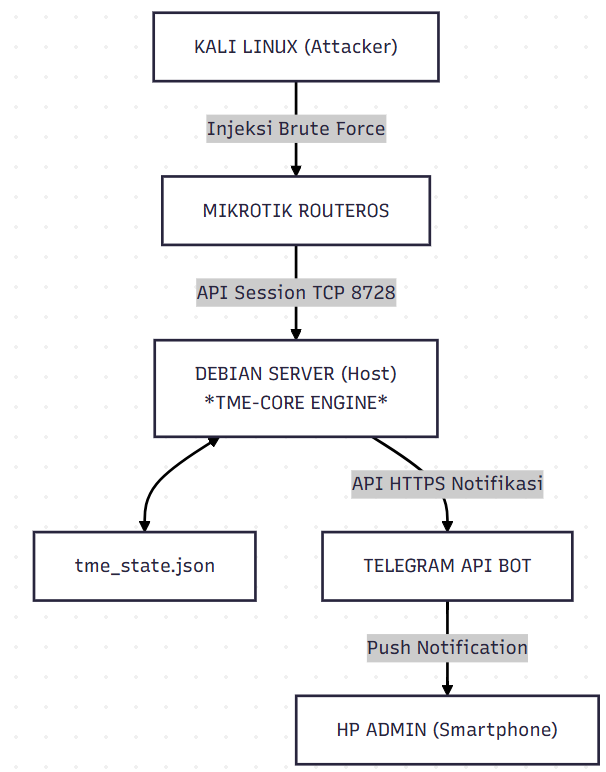

<h1 align="center">
  <span><b align="center">TEUNGKU MITIGATION ENGINE - Core</b></span>
</h1>
<p align="center">
<a href="./docs/install.md">
  
</a>
<a href="./docs/getting_started.md">
  
</a>
<a href="./docs/uninstall.md">
  
</a>
<a href="./docs/troubleshooting.md">
  
</a>
</p>

---

## TME-CORE (Teungku Mitigation Engine - Core)
**TME-CORE** (*Teungku Mitigation Engine - Core*) adalah sebuah mesin mitigasi keamanan otonom berbasis External Controller (Python) yang dirancang untuk melindungi fungsionalitas Control Plane router MikroTik dari ancaman serangan brute force SSH (Port 22) dan FTP (Port 21).

Proyek ini dibangun sebagai bagian dari penelitian tugas akhir/skripsi pada program studi **Teknologi Rekayasa Komputer Jaringan, Politeknik Negeri Lhokseumawe**.

## 💡 Kenapa Proyek Ini Penting & Berguna?
Pada perangkat jaringan tingkat tepi (*edge router*) dengan sumber daya terbatas (seperti MikroTik hAP lite / [<kbd>`RB941-2nD-TC`](https://mikrotik.com/product/RB941-2nD-TC), memproses serangan *brute force* masif yang bertubi-tubi akan menyiksa CPU hingga mencapai **utilitas puncak 100%**. Skenario tanpa mitigasi ini berakibat fatal:</br>
1. Router menjadi **sangat lambat** (*severe lag*), tidak responsif, dan paket-paket data penting mengalami gangguan.</br>
2. Memaksa prosesor bekerja keras dalam jangka panjang memicu *hardware stress* dan **system crash** (kelumpuhan total).</br>
3. Melakukan analisis log di dalam router menggunakan *internal scripting* bawaan RouterOS justru memperburuk utilisasi CPU router itu sendiri.

### Solusi TME-CORE: *Offloading Processing*
TME-CORE memecahkan masalah ini dengan memindahkan beban kerja komputasi analitik (*offloading processing*) keluar dari router menuju server Linux (Debian) menggunakan protokol **API port 8728**.</br>
- **Jalur A (Signature Block):** Melakukan polling data log secara cepat, mendeteksi kegagalan, mengekstrak IP via *Regex*, dan memerintahkan router memblokir penyerang via *Firewall Address-List* (Aturan Drop ringan).</br>
- **Jalur B (Active Session Guard):** Mengawasi celah bypass otentikasi. Jika penyerang berhasil masuk (*login success*) pasca rentetan kegagalan, sistem memutus paksa sesi aktif (*session kick*) via *script injection* v6.x / API v7.x dan mengisolasi IP-nya seketika.

## 🗺️ Arsitektur Aliran Data


## 🚀 Bagaimana Saya Memulainya?
Ikuti panduan langkah demi langkah di bawah ini untuk memasang dan menjalankan TME-CORE di lingkungan laboratorium atau jaringan produksi Anda.

### 📋 Prasyarat Sistem (Prerequisites)
Sebelum melakukan pemasangan, pastikan infrastruktur Anda memenuhi kriteria berikut:</br>
- **Perangkat Tepi:** Routerboard MikroTik (Teruji pada [<kbd>`RB941-2nD-TC`](https://mikrotik.com/product/RB941-2nD-TC), [<kbd>`RB750r2`](https://mikrotik.com/product/RB750r2), dan [<kbd>`RB951G-2HnD`](https://mikrotik.com/product/RB951G-2HnD) dengan RouterOS v6.x maupun v7.x).</br>
- **Server Pengendali:** Server fisik, Virtual Machine, atau Raspberry Pi yang menjalankan **Debian 12 / Ubuntu Server 22.04 LTS**.</br>
- **Python Runtime:** Python 3.8 atau versi yang lebih tinggi (`Python >= 3.8`).</br>
- **Konektivitas:** Pastikan server Debian dan Router MikroTik dapat saling melakukan ping (*IP reachability*) dan service API aktif pada router:
```conf
# Di terminal MikroTik Anda, aktifkan service API
/ip service enable api
```

### 🛠️ Pemasangan (Installation)
Gunakan skrip otomatisasi instalasi (*Auto-Installer*) yang disediakan untuk mempermudah proses inisiasi lingkungan Python:
1. **Unduh (Clone) Repositori:**</br>
**Menggunakan `SSH`**:
```bash
git clone git@github.com:TEUNGKU-ZULKIFLI/TME-CORE.git
```

**Atau dengan menggunakan `HTTP`**:
```bash
git clone https://github.com/TEUNGKU-ZULKIFLI/TME-CORE.git
```

2. **Jalankan Auto-Installer:**
```bash
chmod +x install.sh
```

Berikan izin eksekusi pada skrip, lalu jalankan:
```bash
source install.sh
```

*Skrip ini akan otomatis membuat virtual environment (`venv`), memperbarui `pip`, menginstal seluruh pustaka dependensi (`requirements.txt`), serta membuat berkas konfigurasi `.env` dari templat.*
<h3>Installasi Cast</h3>
<div id="installasi" class="cast-player"></div>

### ⚙️ Konfigurasi (Configuration)
Konfigurasikan variabel rahasia dan parameter mitigasi sistem melalui berkas `.env` yang berada di direktori *root* proyek:
```
nano .env
```

Sesuaikan parameter di dalamnya dengan topologi pengujian Anda:
```
# IP Address dan Port API MikroTik
MIKROTIK_IP=192.168.10.1
MIKROTIK_PORT=8728
MIKROTIK_USER=admin
MIKROTIK_PASS=admin

# Whitelist IP Administrator (Kebal dari pemblokiran otomatis)
WHITELIST_IPS=127.0.0.1,192.168.10.2

# Kredensial Notifikasi Telegram Bot API
TELEGRAM_TOKEN=1234567890:Auah_ybFTHbGj
TELEGRAM_CHAT_ID=987654321
```
<h3>Config Cast</h3>
<div id="config" class="cast-player"></div>

## ⚙️ Menjalankan Sistem (Deployment)
1. **Pengujian Manual (Fase Debugging)**</br>
Aktifkan lingkungan virtual Python dan jalankan program utama menggunakan modul Python:
```
source venv/bin/activate
python3 -m src.main_engine
```

Sistem akan memunculkan menu `TME-CORE Doctor` untuk memverifikasi kesehatan lingkungan kerja Anda sebelum sesi pemantauan dimulai secara real-time.
<h3>Main Engine Cast</h3>
<div id="main_engine" class="cast-player"></div>

2. **Pemasangan Sebagai Layanan Latar Belakang (Systemd Daemon)**</br>
Untuk menjamin kesinambungan operasional 24 jam tanpa harus membiarkan sesi terminal terminal tetap terbuka, pasang TME-CORE sebagai layanan sistem operasi (*system service*):</br>

	2.1. Salin berkas unit layanan (sesuaikan path di dalam `tmecore.service` jika username Debian Anda bukan `/home/teungku`):
	```
	sudo cp assets/tmecore.service /etc/systemd/system/
	```

	2.2. Muat ulang daemon, aktifkan layanan, dan jalankan:
	```
	sudo systemctl daemon-reload
	sudo systemctl enable tmecore.service
	sudo systemctl start tmecore.service
	```

	2.3. Pantau log operasional secara *real-time* menggunakan jurnal Linux:
	```
	sudo journalctl -u tmecore.service -f
	```

## 📈 Struktur Data Evaluasi
Seluruh hasil pemantauan dan barang bukti eksperimen disimpan secara terpisah di dalam folder `/data` guna menunjang pengolahan statistik skripsi Anda:</br>
- `/data/db/tme_state.json`: Menyimpan ingatan jangka panjang status kegagalan login dan IP terblokir (*State Persistence*).</br>
- `/data/metrics/evaluasi_kinerja.csv`: File relasional berisi metrik Beban CPU, Memori RAM Bebas, Latensi, dan Packet Loss saat mitigasi terjadi. Sangat penting untuk diolah menjadi grafik garis di Bab IV.</br>
- `/data/logs/tmecore_system.log`: Log internal kesehatan mesin mitigasi TME-CORE.

## 🤝 Berkontribusi (Contributing)
Kami sangat menyambut baik kontribusi untuk pengembangan sistem ke depan! Silakan baca [CONTRIBUTING](CONTRIBUTING.md) untuk detail panduan, penulisan kode (*SOP*), dan proses penyerahan *Pull Request*.

## 🏷️ Versi Rilis (Versioning)
Sistem ini dikelola menggunakan skema penomoran versi [SemVer](https://semver.org/). Untuk melihat histori versi, perubahan fitur, dan rilis versi stabil, silakan kunjungi halaman [Releases](https://github.com/TEUNGKU-ZULKIFLI/TME-CORE/releases).

## 👨‍💻 Penulis (Authors)
**Teungku Zulkifli** - *Pemilik Proyek & Penulis Utama* - [TEUNGKU-ZULKIFLI](https://teungku-zulkifli.github.io/)

## 📄 Lisensi (License)
Proyek ini dilisensikan di bawah Lisensi MIT - Lihat berkas [LICENSE](LICENSE.md) untuk informasi lebih detail.

## 🎓 Penghargaan (Acknowledgments)
- Terima kasih yang sebesar-besarnya kepada **Dosen Pembimbing Utama (DPU)** & **Dosen Pembimbing Pendamping (DPP)** Jurusan Teknologi Informasi dan Komputer, Politeknik Negeri Lhokseumawe atas bimbingan akademisnya.</br>
- Rekan-rekan mahasiswa angkatan Teknologi Rekayasa Komputer Jaringan (TRKJ).
