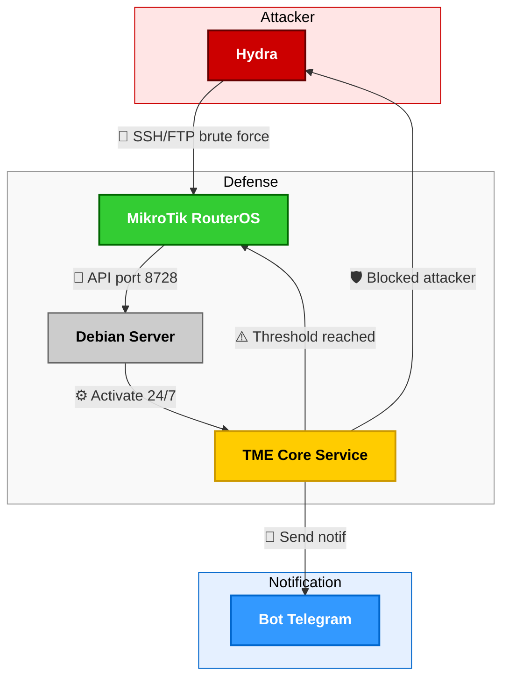

  <picture>
    <source media="(prefers-color-scheme: night)" srcset="./assets/logos/TME-logo01.png" />
    
  </picture>

<h1 align="center"><b>Teungku Mitigation Engine - Core</b></h1>

  🚀 <a href="./docs/getting_started.md">Getting Started</a> · 
  📑 <a href="./docs/all-tahapan.md">Documentation</a> · 
  ❓ <a href="#apa-itu?">Apa itu TME-CORE</a> · 
  ⚙️ <a href="#cara-kerja">Cara Kerja</a> · 
  ✨ <a href="#fitur-utama">Fitur Utama</a> · 
  💻 <a href="#persyaratan-sistem">Persyaratan Sistem</a> · 
  📥 <a href="#installasi">Installasi</a> · 
  🚀 <a href="#panduan-cepat">Panduan Cepat</a> · 
  🗑️ <a href="#uninstallasi">Uninstallasi</a> · 
  🎯 <a href="#tujuan">Tujuan</a> · 
  👤 <a href="#kontribusi">Kontribusi</a> · 
  ⚖️ <a href="#lisensi">Lisensi</a> · 
  📞 <a href="#kontak-support">Kontak / Support</a>

---

## Apa itu?
**`TME-CORE`** adalah sistem mitigasi otomatis untuk serangan **Brute Force SSH/FTP** pada Router MikroTik.
Engine berbasis **Python** ini berjalan di server Debian, menganalisa log secara real-time, mendeteksi anomali, dan melakukan blocking otomatis via API RouterOS dengan latency `< 5 detik` ⚡.

## Cara Kerja

**Narasi alur**:
- **Attacker** mencoba brute force ke port SSH/FTP router.
- **Router** meneruskan log ke server.
- **Server** menjalankan TME-Core 24 jam nonstop.
- **Engine** mendeteksi percobaan gagal, menunggu hingga mencapai threshold.
- Jika threshold tercapai, engine mengirim perintah blokir ke router dan feedback ke attacker.
- Engine juga mengirim **notifikasi** ke Bot Telegram bahwa serangan berhasil ditangani.

## Fitur Utama
- 🔎 Analisis log real-time
- 🛡️ Deteksi brute force otomatis
- ⚡ Blocking cepat via API
- 🔗 Integrasi langsung dengan RouterOS
- 📨 Pesan dari Bot Telegram

## Persyaratan Sistem

## Instalasi

## Panduan Cepat

## Unistallasi

## Tujuan
Memberikan perlindungan ekstra pada Router MikroTik dengan cara yang **ringan, cepat, dan menyenangkan** untuk sysadmin yang ingin tidur lebih nyenyak 😴.

## Kontribusi

## Lisensi

## Kontak Support
