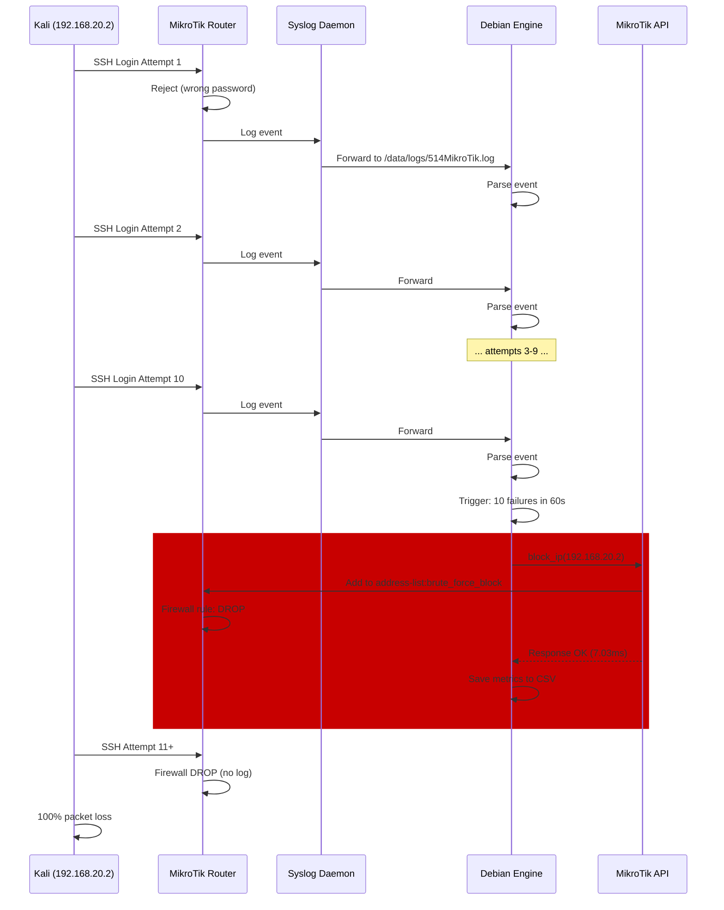

# UML Sequence Diagram - Attack to Mitigation Flow

```mermaid
sequenceDiagram
    participant Attacker as Kali (192.168.20.2)
    participant MikroTik as MikroTik Router
    participant Syslog as Syslog Daemon
    participant Debian as Debian Engine
    participant API as MikroTik API
    
    Attacker->>MikroTik: SSH Login Attempt 1
    MikroTik->>MikroTik: Reject (wrong password)
    MikroTik->>Syslog: Log event
    Syslog->>Debian: Forward to /data/logs/514MikroTik.log
    Debian->>Debian: Parse event #1
    
    Attacker->>MikroTik: SSH Login Attempt 2
    MikroTik->>Syslog: Log event
    Syslog->>Debian: Forward
    Debian->>Debian: Parse event #2
    
    Note over Debian: ... attempts 3-9 ...
    
    Attacker->>MikroTik: SSH Login Attempt 10
    MikroTik->>Syslog: Log event
    Syslog->>Debian: Forward
    Debian->>Debian: Parse event #10
    Debian->>Debian: Trigger: 10 failures in 60s
    
    rect rgb(200, 0, 0)
        Debian->>API: block_ip(192.168.20.2)
        API->>MikroTik: Add to address-list:brute_force_block
        MikroTik->>MikroTik: Firewall rule: DROP
        API-->>Debian: Response OK (7.03ms)
        Debian->>Debian: Save metrics to CSV
    end
    
    Attacker->>MikroTik: SSH Attempt 11+
    MikroTik->>MikroTik: Firewall DROP (no log)
    Attacker->>Attacker: 100% packet loss
```