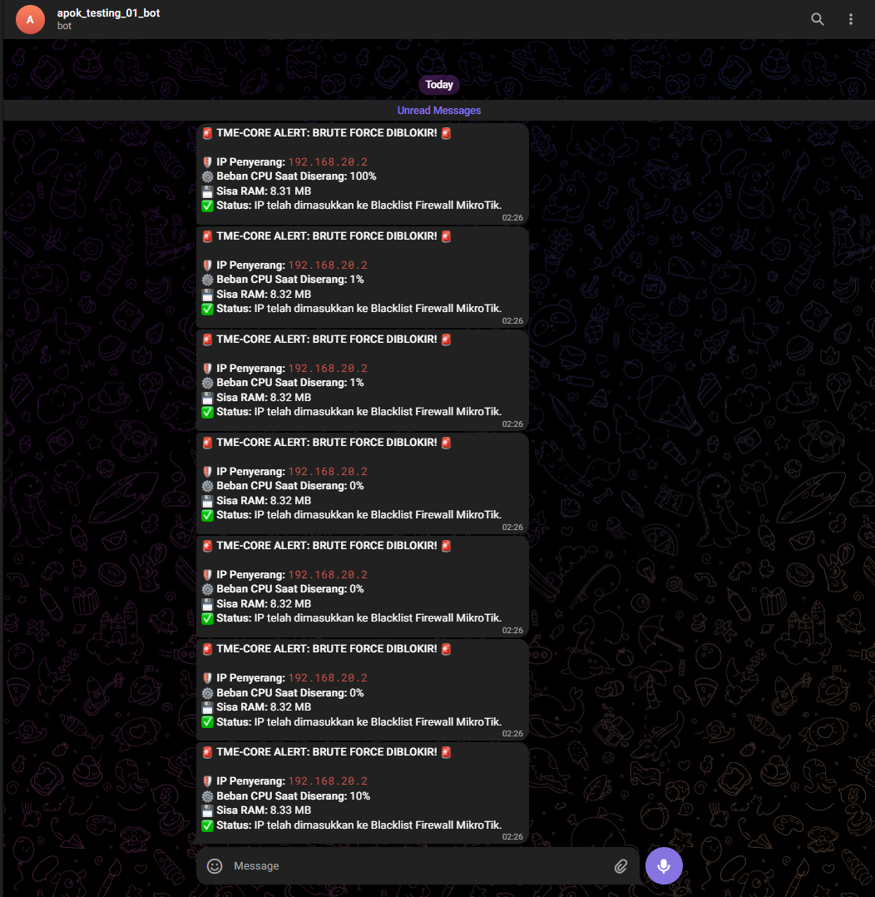

<p align="center">
  <picture>
    <source media="(prefers-color-scheme: night)" srcset="../assets/logos/TME-logo01.png" />
    
  </picture>
</p>
<h1 align="center">
  <span><b align="center">🧑‍💻 TAHAP: Mengirim Notifikasi ke Telegram</b></span>
</h1>

**Deskripsi**:</br>
Menyetup sebuah Bot untuk memberitahukan bahwa IP penyerang sudah terblokir nih!

> [!WARNING]
> > **`SUDAH MENGIKUTI TAHAPAN BERIKUT INI:`**</br>
> > **🧑‍💻 TAHAP: Jembatan komunikasi ke RouterOS**</br>
> > **Deskripsi**:</br>
> > *Membangun koneksi dasar!*</br>
> > **🧑‍💻 TAHAP: Pengecekan Raw Data Log MikroTik**</br>
> > **Deskripsi**:</br>
> > *Mengambil data log mikrotik dasar dengan 5 RAW LOG TERAKHIR!*</br>
> > *Pada Dasarnya sama seperti terminal mikrotik dengan `log print`*</br>
> > **🧑‍💻 TAHAP: Jalur A - Mendeteksi log Brute Force**</br>
> > **Deskripsi**:</br>
> > *Mendeteksi dengan cara memantau log berkala, serta membatasi jika kegagalan login mencapai `THRESHOLD` maka siap untuk dikirimkan ke`modul blokir`.*</br>
> > **🧑‍💻 TAHAP: Jalur B - Menganalisa Beban Router (CPU Monitor)**</br>
> > **Deskripsi**:</br>
> > *Memonitoring secara berkala **`CPU & Memory`** Router.*</br>
> > **🧑‍💻 TAHAP: Menggabungkan Jalur A (Deteksi) & Jalur B (Evaluasi Kinerja)**</br>
> > **Deskripsi**:</br>
> > *Membaca **`/log (Jalur A)`**. Hanya jika ada indikasi `Brute Force`, baru membaca **`/system/resource (Jalur B)`** untuk merekam beban CPU saat itu, mencatatnya ke **`file log`**.*</br>

#### TAHAP 6.1: Setup Bot Telegram
Kali kita tidak akan menyetup `Lingkungan VENV` akan tetapi mendapatkan **`id`** & **`token`** sebuah Bot.</br>

> [!TIP]
> **Siapkan Notepad, atau apalah itu untuk mencatat yang penting**

- Pertama:</br>
    - Pastikan sudah punya **`Account Telegram`** dong!</br>
    - Langsung ke `pencarian` dan ketik `@BotFather` dan pilih yang sesuai dengan yang tertera.
    - Gas **`START`**
- Kedua:</br>
    - Ketikkan pada kolom Pesan dengan `/newbot`
    - Berikan nama untuk bot contoh: `example`
    - Selanjutnya username bot contoh: `example_bot`
    - Jika berhasil nanti akan ditampilkan `Done! Conratulations on your new bot.`
    - Kemudian mencari kalimat `Use this token to access the HTTP API:` dan mencatat HTTP API nya. 
    - 🎉 Selamat kita sudah mendapatkan **`TOKEN`**
- Ketiga:</br>
    - Kembali ke `home` karena ada satu lagi yang kita perlukan!
    - Langsung ke `pencarian` dan ketik `@userinfobot` dan pilih yang sesuai dengan yang tertera.
    - Gas **`START`**
    - Setelah itu bot tersebut akan mengembalikan data-data seperti `@username_account` dan info lainnya.
    - Temukan `Id:xxxx` dan catat ke memo.
    - 🎉 Selamat kita sudah mendapatkan **`ID`**

#### TAHAP 6.2: Konfigurasi
Masih Ingat dengan file `config.py` ?</br>
Yaps kita akan mengisi dua data lagi yaitu:
```bash
# 4. Kredensial Bot Telegram
TELEGRAM_TOKEN = ""     ⬅️ ini yang TOKEN @BotFather
TELEGRAM_CHAT_ID = ""   ⬅️ ini yang ID dari @userinfobot
```
Setelah ini kita wajib setup yaitu `NTP` supaya keakuratan dalam menerima notif.</br>
Pertama di **`SERVER`**:</br>
1. Ubah Timezone ke Asia/Jakarta (WIB)
```bash
sudo timedatectl set-timezone Asia/Jakarta
```
2. Install & Setup Chrony (Pengganti NTP yang lebih modern)
```bash
sudo apt update
```
```bash
sudo apt install chrony -y
```
3. Pastikan Service Aktif
```bash
sudo systemctl enable --now chrony
```
```bash
sudo systemctl status chrony
```
4. Verifikasi Akhir
```bash
timedatectl
```
Output expect:
```bash
user@user:~$ timedatectl
               Local time: Sat 2026-05-16 01:42:58 WIB
           Universal time: Fri 2026-05-15 18:42:58 UTC
                 RTC time: Fri 2026-05-15 18:42:58
                Time zone: Asia/Jakarta (WIB, +0700)
System clock synchronized: yes
              NTP service: active
          RTC in local TZ: no
user@user:~$
```
Kedua di **`ROUTER`**:</br>
1. Memastikan waktu yang sesuai dengan sekarang.
```bash
[admin@MikroTik] > system ntp client print
```
2. Jika belum ada maka bisa dengan:
```bash
[admin@MikroTik] > system ntp client set enabled=yes primary-ntp=162.159.200.1
```
3. Verifikasi Ulang dengan:
```bash
[admin@MikroTik] > system ntp client print
```
Output expect:
```bash
[admin@MikroTik] > system ntp client print
           enabled: yes
       primary-ntp: 162.159.200.1
     secondary-ntp: 0.0.0.0
  server-dns-names:
              mode: unicast
     poll-interval: 16s
     active-server: 162.159.200.1
[admin@MikroTik] >
```
#### TAHAP 6.3: Running Engine
Mulai Ulang dengan menghapus `venv`:
```bash
rm -rf venv/
```
Kemudian menginstall lingkungan `venv`:
```bash
python3 -m venv venv
```
Aktifkan lingkungan **`Virtual Environment`**
```bash
source venv/bin/activate
```
Memastikannya cukup melihat terminal yang dimulai dengan `(venv) user@user:~/TME-CORE$`</br>
Upgrade pip dulu
```bash
pip install --upgrade pip
```
Menginstall reqirements yang dibutuhkan
```bash
pip install -r requirements.txt
```
Melihat package sudah terinstall
```bash
pip list
```
Langsung Gas dengan Running Engine:
```bash
python3 -m src.main_engine
```
Output expect:
```bash
(venv) user@user:~/TME-CORE$ python3 -m src.main_engine
[+] SUKSES: Terhubung ke MikroTik xxx.xxx.xxx.1
==================================================
[-] TME-CORE AKTIF: Deteksi, Evaluasi, & Notifikasi
==================================================
[*] Memori disiapkan. Mengabaikan 165 log lama.
```
Dan dilanjutkan dengan melakukan login remote **`SSH`** Router Mikrotik</br>
tentunya dengan password yang salah, serta menyepam untuk melihat pemblokiran ini berhasil.
```bash
ssh -o MACs=hmac-sha1 admin@xxx.xxx.xxx.1
```
Output expect:
```bash
root@user:/home/user# ssh -o MACs=hmac-sha1 admin@xxx.xxx.xxx.1
admin@xxx.xxx.xxx.1's password:
Permission denied, please try again.
admin@xxx.xxx.xxx.1's password:
Permission denied, please try again.
admin@xxx.xxx.xxx.1's password:
admin@xxx.xxx.xxx.1: Permission denied (password).
root@user:/home/user# ssh -o MACs=hmac-sha1 admin@xxx.xxx.xxx.1
admin@xxx.xxx.xxx.1's password:
Permission denied, please try again.
admin@xxx.xxx.xxx.1's password:
Permission denied, please try again.
admin@xxx.xxx.xxx.1's password:
admin@xxx.xxx.xxx.1: Permission denied (password).
root@user:/home/user# ssh -o MACs=hmac-sha1 admin@xxx.xxx.xxx.1
admin@xxx.xxx.xxx.1's password:
Permission denied, please try again.
admin@xxx.xxx.xxx.1's password:
Permission denied, please try again.
admin@xxx.xxx.xxx.1's password:
admin@xxx.xxx.xxx.1: Permission denied (password).
root@user:/home/user#
```
Kembali keEngine yang sedang Running dan lihat</br>
Output expect:
```bash
[!] DETEKSI: Gagal login dari xxx.xxx.xxx.2 (Gagal ke-1)
[!] DETEKSI: Gagal login dari xxx.xxx.xxx.2 (Gagal ke-2)
[!] DETEKSI: Gagal login dari xxx.xxx.xxx.2 (Gagal ke-3)
[!] DETEKSI: Gagal login dari xxx.xxx.xxx.2 (Gagal ke-4)
[*] DATA EVALUASI DISIMPAN: CPU 100% | RAM sisa 8.31MB
[!] DETEKSI: Gagal login dari xxx.xxx.xxx.2 (Gagal ke-5)
[>>>] THRESHOLD TERCAPAI: Melakukan pemblokiran pada xxx.xxx.xxx.2!
[!] MITIGASI: Mengeksekusi pemblokiran untuk IP xxx.xxx.xxx.2...
[+] SUKSES: IP xxx.xxx.xxx.2 berhasil dimasukkan ke Address List 'brute_force_block'
[*] DATA EVALUASI DISIMPAN: CPU 100% | RAM sisa 8.31MB
[*] Menyiapkan pengiriman laporan ke Telegram...
[+] NOTIFIKASI: Pesan peringatan berhasil dikirim ke Telegram!
[!] DETEKSI: Gagal login dari xxx.xxx.xxx.2 (Gagal ke-1)
[!] DETEKSI: Gagal login dari xxx.xxx.xxx.2 (Gagal ke-2)
[!] DETEKSI: Gagal login dari xxx.xxx.xxx.2 (Gagal ke-3)
[!] DETEKSI: Gagal login dari xxx.xxx.xxx.2 (Gagal ke-4)
[*] DATA EVALUASI DISIMPAN: CPU 1% | RAM sisa 8.32MB
[!] DETEKSI: Gagal login dari xxx.xxx.xxx.2 (Gagal ke-5)
[>>>] THRESHOLD TERCAPAI: Melakukan pemblokiran pada xxx.xxx.xxx.2!
[*] MITIGASI: IP xxx.xxx.xxx.2 sudah berstatus TERBLOKIR sebelumnya.
[*] DATA EVALUASI DISIMPAN: CPU 1% | RAM sisa 8.32MB
[*] Menyiapkan pengiriman laporan ke Telegram...
[+] NOTIFIKASI: Pesan peringatan berhasil dikirim ke Telegram!
[!] DETEKSI: Gagal login dari xxx.xxx.xxx.2 (Gagal ke-1)
[!] DETEKSI: Gagal login dari xxx.xxx.xxx.2 (Gagal ke-2)
[!] DETEKSI: Gagal login dari xxx.xxx.xxx.2 (Gagal ke-3)
[!] DETEKSI: Gagal login dari xxx.xxx.xxx.2 (Gagal ke-4)
[*] DATA EVALUASI DISIMPAN: CPU 1% | RAM sisa 8.32MB
[!] DETEKSI: Gagal login dari xxx.xxx.xxx.2 (Gagal ke-5)
[>>>] THRESHOLD TERCAPAI: Melakukan pemblokiran pada xxx.xxx.xxx.2!
[*] MITIGASI: IP xxx.xxx.xxx.2 sudah berstatus TERBLOKIR sebelumnya.
[*] DATA EVALUASI DISIMPAN: CPU 1% | RAM sisa 8.32MB
[*] Menyiapkan pengiriman laporan ke Telegram...
[+] NOTIFIKASI: Pesan peringatan berhasil dikirim ke Telegram!
[!] DETEKSI: Gagal login dari xxx.xxx.xxx.2 (Gagal ke-1)
[!] DETEKSI: Gagal login dari xxx.xxx.xxx.2 (Gagal ke-2)
[!] DETEKSI: Gagal login dari xxx.xxx.xxx.2 (Gagal ke-3)
[!] DETEKSI: Gagal login dari xxx.xxx.xxx.2 (Gagal ke-4)
[*] DATA EVALUASI DISIMPAN: CPU 0% | RAM sisa 8.32MB
[!] DETEKSI: Gagal login dari xxx.xxx.xxx.2 (Gagal ke-5)
[>>>] THRESHOLD TERCAPAI: Melakukan pemblokiran pada xxx.xxx.xxx.2!
[*] MITIGASI: IP xxx.xxx.xxx.2 sudah berstatus TERBLOKIR sebelumnya.
[*] DATA EVALUASI DISIMPAN: CPU 0% | RAM sisa 8.32MB
[*] Menyiapkan pengiriman laporan ke Telegram...
[+] NOTIFIKASI: Pesan peringatan berhasil dikirim ke Telegram!
[!] DETEKSI: Gagal login dari xxx.xxx.xxx.2 (Gagal ke-1)
[!] DETEKSI: Gagal login dari xxx.xxx.xxx.2 (Gagal ke-2)
[!] DETEKSI: Gagal login dari xxx.xxx.xxx.2 (Gagal ke-3)
[!] DETEKSI: Gagal login dari xxx.xxx.xxx.2 (Gagal ke-4)
[*] DATA EVALUASI DISIMPAN: CPU 0% | RAM sisa 8.32MB
[!] DETEKSI: Gagal login dari xxx.xxx.xxx.2 (Gagal ke-5)
[>>>] THRESHOLD TERCAPAI: Melakukan pemblokiran pada xxx.xxx.xxx.2!
[*] MITIGASI: IP xxx.xxx.xxx.2 sudah berstatus TERBLOKIR sebelumnya.
[*] DATA EVALUASI DISIMPAN: CPU 0% | RAM sisa 8.32MB
[*] Menyiapkan pengiriman laporan ke Telegram...
[+] NOTIFIKASI: Pesan peringatan berhasil dikirim ke Telegram!
[!] DETEKSI: Gagal login dari xxx.xxx.xxx.2 (Gagal ke-1)
[!] DETEKSI: Gagal login dari xxx.xxx.xxx.2 (Gagal ke-2)
[!] DETEKSI: Gagal login dari xxx.xxx.xxx.2 (Gagal ke-3)
[!] DETEKSI: Gagal login dari xxx.xxx.xxx.2 (Gagal ke-4)
[*] DATA EVALUASI DISIMPAN: CPU 0% | RAM sisa 8.32MB
[!] DETEKSI: Gagal login dari xxx.xxx.xxx.2 (Gagal ke-5)
[>>>] THRESHOLD TERCAPAI: Melakukan pemblokiran pada xxx.xxx.xxx.2!
[*] MITIGASI: IP xxx.xxx.xxx.2 sudah berstatus TERBLOKIR sebelumnya.
[*] DATA EVALUASI DISIMPAN: CPU 0% | RAM sisa 8.32MB
[*] Menyiapkan pengiriman laporan ke Telegram...
[+] NOTIFIKASI: Pesan peringatan berhasil dikirim ke Telegram!
[!] DETEKSI: Gagal login dari xxx.xxx.xxx.2 (Gagal ke-1)
[!] DETEKSI: Gagal login dari xxx.xxx.xxx.2 (Gagal ke-2)
[!] DETEKSI: Gagal login dari xxx.xxx.xxx.2 (Gagal ke-3)
[!] DETEKSI: Gagal login dari xxx.xxx.xxx.2 (Gagal ke-4)
[*] DATA EVALUASI DISIMPAN: CPU 10% | RAM sisa 8.33MB
[!] DETEKSI: Gagal login dari xxx.xxx.xxx.2 (Gagal ke-5)
[>>>] THRESHOLD TERCAPAI: Melakukan pemblokiran pada xxx.xxx.xxx.2!
[*] MITIGASI: IP xxx.xxx.xxx.2 sudah berstatus TERBLOKIR sebelumnya.
[*] DATA EVALUASI DISIMPAN: CPU 10% | RAM sisa 8.33MB
[*] Menyiapkan pengiriman laporan ke Telegram...
[+] NOTIFIKASI: Pesan peringatan berhasil dikirim ke Telegram!
```
Dan menerima pesan Bot Telegram dengan berikut ini:
```bash
🚨 TME-CORE ALERT: BRUTE FORCE DIBLOKIR! 🚨

🛡️ IP Penyerang: 192.168.20.2
⚙️ Beban CPU Saat Diserang: 100%
💾 Sisa RAM: 8.31 MB
✅ Status: IP telah dimasukkan ke Blacklist Firewall MikroTik.
```
Dengan by Visual:</br>
<p align="center">
  
</p>

Kemudian closing engine cukup ketik **`Ctrl + c`**:
```bash
^C
[*] Pemantauan dihentikan user.
[*] Koneksi ke MikroTik ditutup dengan aman.
(venv) user@user:~/TME-CORE$
```
Setelah closing engine, pada folder root `~/TME-CORE` akan ada file **`tmecore.log`**</br>
Mari kita intip file log tersebut dengan:
```bash
tail -f tmecore.log
```
Output expect:
```bash
(venv) user@user:~/TME-CORE$ tail -f tmecore.log
[2026-05-18 02:26:30] IP: xxx.xxx.xxx.2 | Aksi: SEDANG DISERANG | CPU: 100% | Sisa RAM: 8.31MB / 32.00MB
[2026-05-18 02:26:30] IP: xxx.xxx.xxx.2 | Aksi: BERHASIL DIBLOKIR | CPU: 100% | Sisa RAM: 8.31MB / 32.00MB
[2026-05-18 02:26:35] IP: xxx.xxx.xxx.2 | Aksi: SEDANG DISERANG | CPU: 1% | Sisa RAM: 8.32MB / 32.00MB
[2026-05-18 02:26:35] IP: xxx.xxx.xxx.2 | Aksi: BERHASIL DIBLOKIR | CPU: 1% | Sisa RAM: 8.32MB / 32.00MB
[2026-05-18 02:26:36] IP: xxx.xxx.xxx.2 | Aksi: SEDANG DISERANG | CPU: 1% | Sisa RAM: 8.32MB / 32.00MB
[2026-05-18 02:26:36] IP: xxx.xxx.xxx.2 | Aksi: BERHASIL DIBLOKIR | CPU: 1% | Sisa RAM: 8.32MB / 32.00MB
[2026-05-18 02:26:37] IP: xxx.xxx.xxx.2 | Aksi: SEDANG DISERANG | CPU: 0% | Sisa RAM: 8.32MB / 32.00MB
[2026-05-18 02:26:37] IP: xxx.xxx.xxx.2 | Aksi: BERHASIL DIBLOKIR | CPU: 0% | Sisa RAM: 8.32MB / 32.00MB
[2026-05-18 02:26:37] IP: xxx.xxx.xxx.2 | Aksi: SEDANG DISERANG | CPU: 0% | Sisa RAM: 8.32MB / 32.00MB
[2026-05-18 02:26:38] IP: xxx.xxx.xxx.2 | Aksi: BERHASIL DIBLOKIR | CPU: 0% | Sisa RAM: 8.32MB / 32.00MB
[2026-05-18 02:26:39] IP: xxx.xxx.xxx.2 | Aksi: SEDANG DISERANG | CPU: 0% | Sisa RAM: 8.32MB / 32.00MB
[2026-05-18 02:26:39] IP: xxx.xxx.xxx.2 | Aksi: BERHASIL DIBLOKIR | CPU: 0% | Sisa RAM: 8.32MB / 32.00MB
[2026-05-18 02:26:43] IP: xxx.xxx.xxx.2 | Aksi: SEDANG DISERANG | CPU: 10% | Sisa RAM: 8.33MB / 32.00MB
[2026-05-18 02:26:43] IP: xxx.xxx.xxx.2 | Aksi: BERHASIL DIBLOKIR | CPU: 10% | Sisa RAM: 8.33MB / 32.00MB
```

#### RANGKUMAN:
Pada Tahap ini memang sudah bisa merespon ke bot Telegram, akan tetapi data yang dikirim terlalu `nyepam/ngebomb`.</br>
Untuk selanjutnya kita akan mem`fixedkan` `bug` tersebut itu.

### RECAP ALL:
```bash
user@user:~/TME-CORE$ source venv/bin/activate
(venv) user@user:~/TME-CORE$ python3 -m src.main_engine
[+] SUKSES: Terhubung ke MikroTik xxx.xxx.xxx.1
==================================================
[-] TME-CORE AKTIF: Deteksi (Jalur A) & Evaluasi (Jalur B)
==================================================
[*] Memori disiapkan. Mengabaikan 86 log lama.
[!] DETEKSI: Gagal login dari xxx.xxx.xxx.2 (Gagal ke-1)
[!] DETEKSI: Gagal login dari xxx.xxx.xxx.2 (Gagal ke-2)
[!] DETEKSI: Gagal login dari xxx.xxx.xxx.2 (Gagal ke-3)
[!] DETEKSI: Gagal login dari xxx.xxx.xxx.2 (Gagal ke-4)
[*] DATA EVALUASI DISIMPAN: CPU 100% | RAM sisa 8.58MB
[!] DETEKSI: Gagal login dari xxx.xxx.xxx.2 (Gagal ke-5)
[>>>] THRESHOLD TERCAPAI: Melakukan pemblokiran pada xxx.xxx.xxx.2!
[!] MITIGASI: Mengeksekusi pemblokiran untuk IP xxx.xxx.xxx.2...
[+] SUKSES: IP xxx.xxx.xxx.2 berhasil dimasukkan ke Address List 'brute_force_block'
[*] DATA EVALUASI DISIMPAN: CPU 100% | RAM sisa 8.58MB
[!] DETEKSI: Gagal login dari xxx.xxx.xxx.2 (Gagal ke-1)
[!] DETEKSI: Gagal login dari xxx.xxx.xxx.2 (Gagal ke-2)
[!] DETEKSI: Gagal login dari xxx.xxx.xxx.2 (Gagal ke-3)
[!] DETEKSI: Gagal login dari xxx.xxx.xxx.2 (Gagal ke-4)
[*] DATA EVALUASI DISIMPAN: CPU 100% | RAM sisa 8.58MB
[!] DETEKSI: Gagal login dari xxx.xxx.xxx.2 (Gagal ke-5)
[>>>] THRESHOLD TERCAPAI: Melakukan pemblokiran pada xxx.xxx.xxx.2!
[*] MITIGASI: IP xxx.xxx.xxx.2 sudah berstatus TERBLOKIR sebelumnya.
[*] DATA EVALUASI DISIMPAN: CPU 100% | RAM sisa 8.58MB
[!] DETEKSI: Gagal login dari xxx.xxx.xxx.2 (Gagal ke-1)
[!] DETEKSI: Gagal login dari xxx.xxx.xxx.2 (Gagal ke-2)
[!] DETEKSI: Gagal login dari xxx.xxx.xxx.2 (Gagal ke-3)
[!] DETEKSI: Gagal login dari xxx.xxx.xxx.2 (Gagal ke-4)
[*] DATA EVALUASI DISIMPAN: CPU 100% | RAM sisa 8.58MB
[!] DETEKSI: Gagal login dari xxx.xxx.xxx.2 (Gagal ke-5)
[>>>] THRESHOLD TERCAPAI: Melakukan pemblokiran pada xxx.xxx.xxx.2!
[*] MITIGASI: IP xxx.xxx.xxx.2 sudah berstatus TERBLOKIR sebelumnya.
[*] DATA EVALUASI DISIMPAN: CPU 100% | RAM sisa 8.58MB
[!] DETEKSI: Gagal login dari xxx.xxx.xxx.2 (Gagal ke-1)
[!] DETEKSI: Gagal login dari xxx.xxx.xxx.2 (Gagal ke-2)
[!] DETEKSI: Gagal login dari xxx.xxx.xxx.2 (Gagal ke-3)
[!] DETEKSI: Gagal login dari xxx.xxx.xxx.2 (Gagal ke-4)
[*] DATA EVALUASI DISIMPAN: CPU 100% | RAM sisa 8.58MB
[!] DETEKSI: Gagal login dari xxx.xxx.xxx.2 (Gagal ke-5)
[>>>] THRESHOLD TERCAPAI: Melakukan pemblokiran pada xxx.xxx.xxx.2!
[*] MITIGASI: IP xxx.xxx.xxx.2 sudah berstatus TERBLOKIR sebelumnya.
[*] DATA EVALUASI DISIMPAN: CPU 100% | RAM sisa 8.58MB
[!] DETEKSI: Gagal login dari xxx.xxx.xxx.2 (Gagal ke-1)
[!] DETEKSI: Gagal login dari xxx.xxx.xxx.2 (Gagal ke-2)
[!] DETEKSI: Gagal login dari xxx.xxx.xxx.2 (Gagal ke-3)
[!] DETEKSI: Gagal login dari xxx.xxx.xxx.2 (Gagal ke-4)
[*] DATA EVALUASI DISIMPAN: CPU 100% | RAM sisa 8.58MB
[!] DETEKSI: Gagal login dari xxx.xxx.xxx.2 (Gagal ke-5)
[>>>] THRESHOLD TERCAPAI: Melakukan pemblokiran pada xxx.xxx.xxx.2!
[*] MITIGASI: IP xxx.xxx.xxx.2 sudah berstatus TERBLOKIR sebelumnya.
[*] DATA EVALUASI DISIMPAN: CPU 100% | RAM sisa 8.58MB
[!] DETEKSI: Gagal login dari xxx.xxx.xxx.2 (Gagal ke-1)
[!] DETEKSI: Gagal login dari xxx.xxx.xxx.2 (Gagal ke-2)
[!] DETEKSI: Gagal login dari xxx.xxx.xxx.2 (Gagal ke-3)
[!] DETEKSI: Gagal login dari xxx.xxx.xxx.2 (Gagal ke-4)
[*] DATA EVALUASI DISIMPAN: CPU 100% | RAM sisa 8.58MB
[!] DETEKSI: Gagal login dari xxx.xxx.xxx.2 (Gagal ke-5)
[>>>] THRESHOLD TERCAPAI: Melakukan pemblokiran pada xxx.xxx.xxx.2!
[*] MITIGASI: IP xxx.xxx.xxx.2 sudah berstatus TERBLOKIR sebelumnya.
[*] DATA EVALUASI DISIMPAN: CPU 100% | RAM sisa 8.58MB
[!] DETEKSI: Gagal login dari xxx.xxx.xxx.2 (Gagal ke-1)
[!] DETEKSI: Gagal login dari xxx.xxx.xxx.2 (Gagal ke-2)
[!] DETEKSI: Gagal login dari xxx.xxx.xxx.2 (Gagal ke-3)
[!] DETEKSI: Gagal login dari xxx.xxx.xxx.2 (Gagal ke-4)
[*] DATA EVALUASI DISIMPAN: CPU 100% | RAM sisa 8.58MB
[!] DETEKSI: Gagal login dari xxx.xxx.xxx.2 (Gagal ke-5)
[>>>] THRESHOLD TERCAPAI: Melakukan pemblokiran pada xxx.xxx.xxx.2!
[*] MITIGASI: IP xxx.xxx.xxx.2 sudah berstatus TERBLOKIR sebelumnya.
[*] DATA EVALUASI DISIMPAN: CPU 100% | RAM sisa 8.58MB
[!] DETEKSI: Gagal login dari xxx.xxx.xxx.2 (Gagal ke-1)
^C
[*] Pemantauan dihentikan user.
[*] Koneksi ke MikroTik ditutup dengan aman.
(venv) user@user:~/TME-CORE$ tail -f tmecore.log
[2026-05-18 02:26:30] IP: xxx.xxx.xxx.2 | Aksi: SEDANG DISERANG | CPU: 100% | Sisa RAM: 8.31MB / 32.00MB
[2026-05-18 02:26:30] IP: xxx.xxx.xxx.2 | Aksi: BERHASIL DIBLOKIR | CPU: 100% | Sisa RAM: 8.31MB / 32.00MB
[2026-05-18 02:26:35] IP: xxx.xxx.xxx.2 | Aksi: SEDANG DISERANG | CPU: 1% | Sisa RAM: 8.32MB / 32.00MB
[2026-05-18 02:26:35] IP: xxx.xxx.xxx.2 | Aksi: BERHASIL DIBLOKIR | CPU: 1% | Sisa RAM: 8.32MB / 32.00MB
[2026-05-18 02:26:36] IP: xxx.xxx.xxx.2 | Aksi: SEDANG DISERANG | CPU: 1% | Sisa RAM: 8.32MB / 32.00MB
[2026-05-18 02:26:36] IP: xxx.xxx.xxx.2 | Aksi: BERHASIL DIBLOKIR | CPU: 1% | Sisa RAM: 8.32MB / 32.00MB
[2026-05-18 02:26:37] IP: xxx.xxx.xxx.2 | Aksi: SEDANG DISERANG | CPU: 0% | Sisa RAM: 8.32MB / 32.00MB
[2026-05-18 02:26:37] IP: xxx.xxx.xxx.2 | Aksi: BERHASIL DIBLOKIR | CPU: 0% | Sisa RAM: 8.32MB / 32.00MB
[2026-05-18 02:26:37] IP: xxx.xxx.xxx.2 | Aksi: SEDANG DISERANG | CPU: 0% | Sisa RAM: 8.32MB / 32.00MB
[2026-05-18 02:26:38] IP: xxx.xxx.xxx.2 | Aksi: BERHASIL DIBLOKIR | CPU: 0% | Sisa RAM: 8.32MB / 32.00MB
[2026-05-18 02:26:39] IP: xxx.xxx.xxx.2 | Aksi: SEDANG DISERANG | CPU: 0% | Sisa RAM: 8.32MB / 32.00MB
[2026-05-18 02:26:39] IP: xxx.xxx.xxx.2 | Aksi: BERHASIL DIBLOKIR | CPU: 0% | Sisa RAM: 8.32MB / 32.00MB
[2026-05-18 02:26:43] IP: xxx.xxx.xxx.2 | Aksi: SEDANG DISERANG | CPU: 10% | Sisa RAM: 8.33MB / 32.00MB
[2026-05-18 02:26:43] IP: xxx.xxx.xxx.2 | Aksi: BERHASIL DIBLOKIR | CPU: 10% | Sisa RAM: 8.33MB / 32.00MB
^C
(venv) user@user:~/TME-CORE$
```
<p align=right>
<a href="./tahap5.md#--%E2%80%8D-tahap-menggabungkan-jalur-a-deteksi--jalur-b-evaluasi-kinerja">
  
</a>
<a href="./tahap7.md#--%E2%80%8D-tahap-menjadikan-tme-core-berjalan-di-background-systemd">
  
</a>
</p>