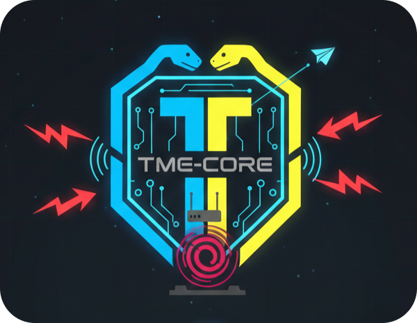

<p align="center">
  <picture>
    <source media="(prefers-color-scheme: night)" srcset="../assets/logos/TME-logo01.png" />
    
  </picture>
</p>
<h1 align="center">
  <span><b align="center">🗑️ UNINSTALLASI with TME-CORE</b></span>
</h1>

---

# 🗑️ Panduan Penghapusan Sistem (Uninstall Guide)
Dokumen ini memandu Anda untuk membersihkan sistem TME-CORE, berkas konfigurasi, serta aturan firewall pada router target secara aman dan menyeluruh.

## 🧹 Langkah 1: Menghapus Layanan di Server Debian
Jika TME-CORE dipasang sebagai layanan latar belakang (system service), lakukan penghentian dan penghapusan layanan dari sistem operasi Debian Anda:

1. Hentikan layanan TME-CORE yang sedang berjalan

```
sudo systemctl stop tmecore.service
```

2. Nonaktifkan layanan dari startup otomatis

```
sudo systemctl disable tmecore.service
```

3. Hapus file unit layanan systemd

```
sudo rm /etc/systemd/system/tmecore.service
```

4. Muat ulang daemon sistem untuk menyegarkan konfigurasi

```
sudo systemctl daemon-reload
```

## 🧹 Langkah 2: Menggunakan Skrip Pembersih Otomatis
TME-CORE menyediakan skrip pembersih `uninstall.sh` di direktori utama proyek untuk menghapus lingkungan virtual, berkas konfigurasi `.env`, dan folder log data secara otomatis:

- Memberikan hak izin eksekusi pada skrip pembersih

```
chmod +x uninstall.sh
```

- Menjalankan pembersihan total

```
source uninstall.sh
```

**⚠️ Perhatian:** Skrip ini akan menghapus folder `venv/`, berkas `.env,` dan database status `tme_state.json`. Pastikan Anda telah menyalin berkas metrik `evaluasi_kinerja.csv` di folder `data/metrics/` jika Anda masih membutuhkannya untuk pengolahan statistik skripsi.

## 🧹 Langkah 3: Membersihkan Konfigurasi MikroTik (RouterOS)
Agar router MikroTik target kembali ke kondisi semula sebelum pengujian, lakukan pembersihan manual pada aturan firewall:

1. **Hapus Aturan Firewall Filter:**</br>
Masuk ke Winbox, buka menu **IP > Firewall > Filter Rules**. Cari aturan yang men-drop paket dari `brute_force_block` lalu hapus (*remove*).

2. **Hapus Aturan Firewall Address-List:**</br>
Buka menu **IP > Firewall > Address Lists**. Hapus daftar alamat IP penyerang yang pernah diblokir oleh TME-CORE.

3. **(Opsional) Matikan Layanan API:**</br>
Jika layanan API tidak lagi digunakan oleh aplikasi lain, Anda dapat menonaktifkannya kembali demi alasan pengerasan keamanan perangkat (*device hardening*):

```
/ip service disable api
```
